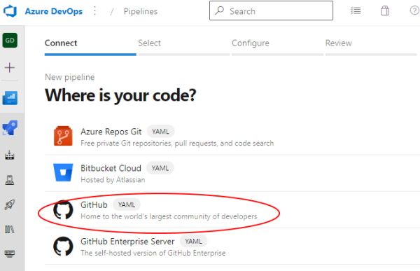
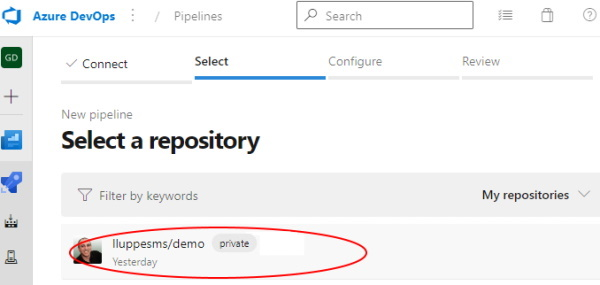
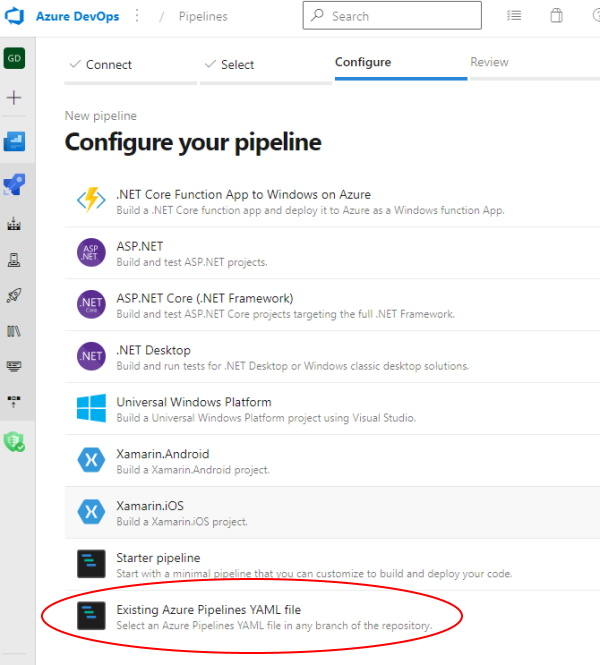
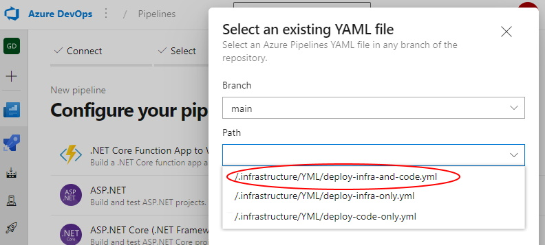
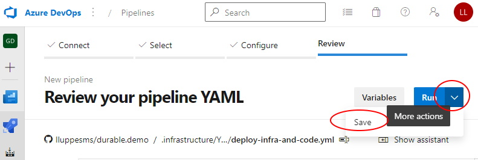
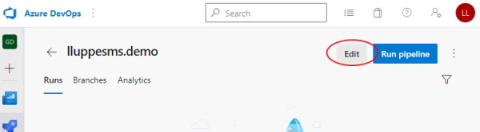
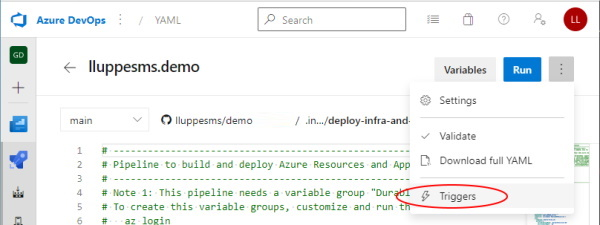
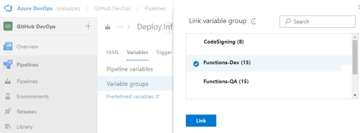
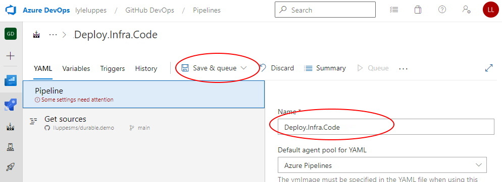

# Setting up an Azure DevOps pipeline

To create an Azure DevOps pipeline from an existing YML file in a GitHub repository, follow these steps.

This project has a "deploy-infra-pipeline.yml" and a "deploy-app-pipeline.yml" pipeline, which will deploy all of the Azure resources using Bicep, and then deploy the logic app to those resources.

---

**Step 1:** Click New pipeline from the Pipeline section of the Azure DevOps project

**Step 2:** Select source as GitHub:

**Step 3:** Select the GitHub repository

**Step 4:** Select Existing Pipelines YAML file

**Step 5:** Select the desired pipeline

**Step 6:** When the pipeline source is shown, select More Actions and Save the file. Don't worry about details yet, there are still more steps before it's ready to Run.

**Step 7:** Once the new pipeline page is shown, click the Edit button.

**Step 8:** This may not seem intuitive, but the detailed editor is hidden behind the "Triggers" option of the pipeline editor, so select that.

**Step 9:** On the detailed pipeline editor, select Variables -> Variable Groups, and link the variable groups that are needed for this pipeline.

**Step 10:** More than one variable group can be added to a pipeline.

**Step 11:** Switch to the YAML tab and update the name of the pipeline to be what is desired. Now the "Save and queue" is ready, and the pipeline can be run.

