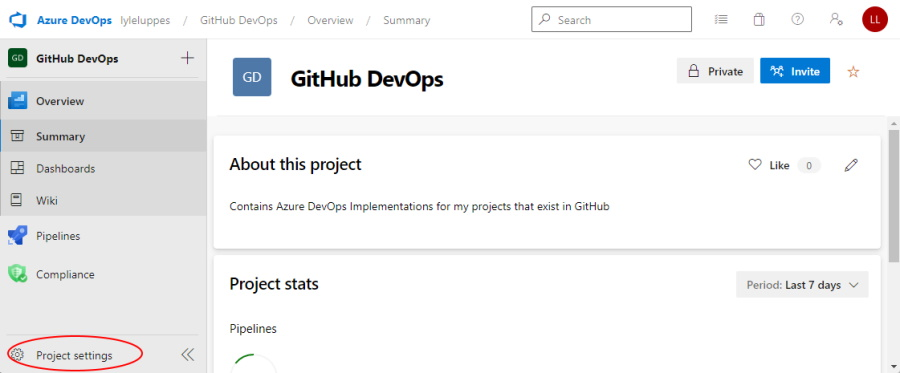
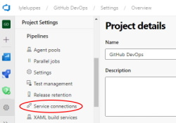
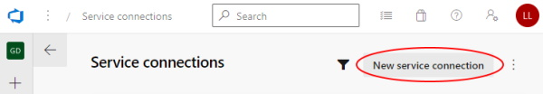
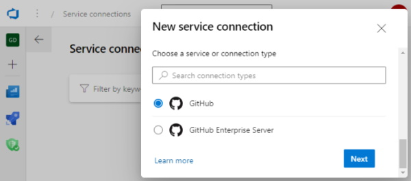
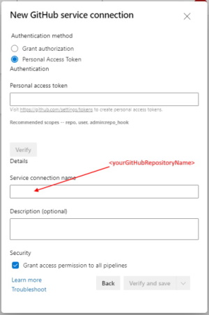
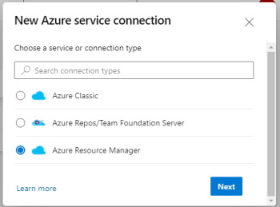
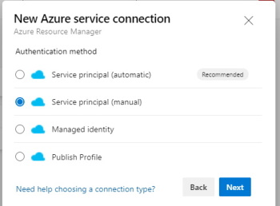
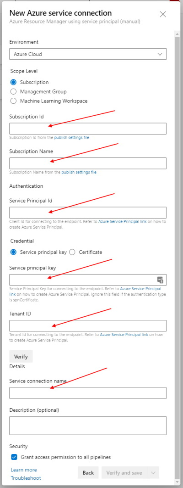

# Set up an Azure DevOps Service Connections

To enable Azure DevOps pipelines to run against a GitHub repository, both GitHub Service Connection and an Azure Subscription Service Connection need to be set up.

---
## GitHub Service Connection

**Step 1:** Go to the project settings page:

**Step 2:** Select Service Connections:

**Step 3:** Add new Service Connection:

---
## GitHub Service Connection
**Step 4:** Select GitHub

**Step 5:** Authenticate GitHub using a PAT token. (For ease of use, it is recommended that the GitHub service connection name be the same as the GitHub account is being referenced.)

---
## Azure Subscription Connection
**Step 6:** Select Azure Resource Manager

**Step 7:** Create a Service Principal and Client Secret before this step is executed, then select the Service principal (manual) option.

**Step 8:** For this step, things that are needed include the Azure Subscription name and Id, the Azure AD Service Principal Client Id and Tenant Id, and the Client Secret that was created in the previous step.
(For ease of use, it is recommended that the Azure service connection name be the same as the Azure Subscription name that is being referenced.)

---
Now go create some pipelines!

---
## References:
For more information, see:  https://docs.microsoft.com/en-us/azure/devops/pipelines/library/service-endpoints?view=azure-devops&tabs=yaml

