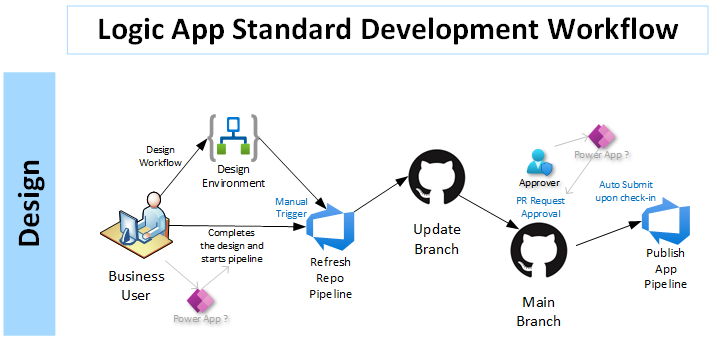
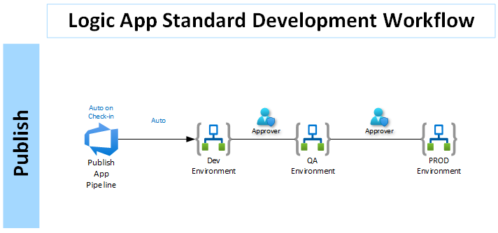

# Updating Logic App Repository

This pipeline will scan an existing Logic App in the Azure portal and pull down the source code for that application into a local repository.  

---

**Step 1:** Initialize: An admin will fork this repo and set up pipelines.

**Step 2:** Design: User will design the logic app in the Azure portal. Once they are complete, they will trigger refresh workflow.

**Step 3:** Deploy: Click New pipeline from the Pipeline section of the Azure DevOps project

