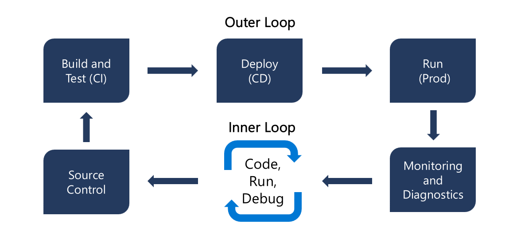

# Logic Apps Standard DevOps - Accelerator 

Azure Logic Apps Standard provides an opportunity to enable a traditional developer workflow, and associated benefits(local development, source control, automation) with low code tooling. The goal of this repository is to augment existing documentation to accelerate the use of CICD practices enabled with [Azure Logic Apps Standard](https://docs.microsoft.com/en-us/azure/logic-apps/devops-deployment-single-tenant-azure-logic-apps). This is accomplished by providing a demo implemantation and highlighting best practices and workarounds to common challenges.

***Aligns with traditional CI/CD Delivery Model***



***Separation of Concerns***


The single-tenant model gives you the capability to separate the concerns between app and the underlying infrastructure. For example, you can develop, build, zip, and deploy your app separately as an immutable artifact to different environments. Logic app workflows typically have "application code" that you update more often than the underlying infrastructure. By separating these layers, you can focus more on building out your logic app's workflow and spend less on your effort to deploy the required resources across multiple environments.

## Local Development

### Prerequisites

#### 1. Development Tools 

Follow the prerequisite guide [here](https://docs.microsoft.com/en-us/azure/logic-apps/create-single-tenant-workflows-visual-studio-code#prerequisites)

> **Note**
> There is a bug with Azurite 3.17 so currently the best way to isntall Azureite is via NPM:
>
> ``` bash
> npm uninstall -g azurite
> npm install -g azurite@3.16.0
> ```

#### 2. Azure Environment

A Service Principal is required with Owner RBAC to a Resource Group in Azure. The following resoureces will be created as part of the IaC.

- Storage Account for Logic App
- Logic App Service
- Log Analytics
- Application Insights
- Storage Account for Integration


#### 3. Azure Devops Project

An Azure DevOps project is required for running CICD pipelines. A service connection needs to be created for the piplines to deploy into the Azure sandbox resrouce group:

https://docs.microsoft.com/en-us/azure/devops/pipelines/library/connect-to-azure?view=azure-devops#create-an-azure-resource-manager-service-connection-with-an-existing-service-principal

#### 4. Azure Devops Variable Groups
The pipelines in this project are customized using an Azure DevOps Variable Group. Variable groups can be created via the command line as shown in the [Create Variable Groups](Infrastructure/docs/Create-Variable-Group.md) document.

#### 5. Azure Devops Pipelines
Two CICD pipelines have been created with YML. Instructions on how to create pipelines can be found in the  [Create Pipelines](Infrastructure/docs/Create-Pipeline.md) document.

- [deploy-infra-pipeline.yml](Infrastructure/yml/deploy-infra-pipeline.yml)
- [deploy-app-pipeline.yml.yml](Infrastructure/yml/deploy-app-pipeline.yml.yml)

## Solution Componets

The following diagram shows the dependencies between the demo logic app solution and the infrastructure resources:


***Hosting***

An app service plan and storage account resource are needed to host the logic app standard runtime.

***Security***

A Managed Identity, associated with the resource is ussed to acccess different azure resources. Azure RBAC can be used to assign access.

***Logic***

An 'EventTrigger' and 'EventProcessor' workflows are persited as JSON files and deploy into the Logic App

***Azure Connectors***

Azure BlobStorage Managed connector provides access to Azure blob storage.

## CICD Design


## Challenges and Known Issues

### Local Development

1. Version compatibility exist between development tools and extensions. Azurite v3.16.0 with Logic App Standard extension is known to work v1.0.14.
2. Locally AppSettings do not resolve in Connections.json. Having local versions of files that are swaped with Azure versions is a workaround.
3. Managed Identites cannot be used to connect with Azure Connectors. Locally you will need versions of Azure connectors that can be used with keys/connection strings and config can be swapped at build.

### CICD

1. Lack of ARM/Bicep schema documentation exits for many connectors.
2. Schema for using ManagedIdentiry with Managed Connection is not well documented. [Link](https://github.com/Azure/bicep/issues/5516)
3. Development done in Azure Portal needs to be manually copied to source control. 

### Links
- https://github.com/Azure/logicapps/issues/609

##  Reference

### Local Development
- https://docs.microsoft.com/en-us/azure/logic-apps/create-single-tenant-workflows-visual-studio-code

### CICD
- https://docs.microsoft.com/en-us/azure/logic-apps/devops-deployment-single-tenant-azure-logic-apps
- https://docs.microsoft.com/en-us/azure/logic-apps/set-up-devops-deployment-single-tenant-azure-logic-apps?tabs=github
- https://mattruma.com/adventures-with-logic-apps-using-bicep-to-deploy-logic-apps/

### Observability
- https://docs.microsoft.com/en-us/azure/logic-apps/create-single-tenant-workflows-azure-portal#enable-or-open-application-insights-after-deployment


