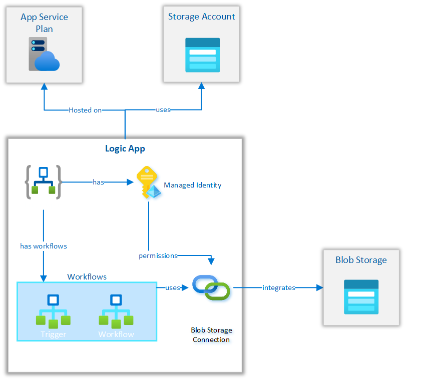
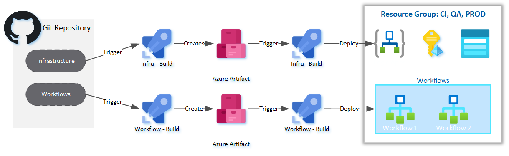

# Logic Apps Standard - Accelerator 

## Prerequisites

### 1. Development Tools 

Follow the prerequisite guid here:

https://docs.microsoft.com/en-us/azure/logic-apps/create-single-tenant-workflows-visual-studio-code#prerequisites

***NOTE***

Unless you are familiar with the other deployment options we recommend installing Azurite via the VSCode extension:

- https://marketplace.visualstudio.com/items?itemName=Azurite.azurite

### 2. Azure Environment

A Service Principal is required with Owner RBAC to a Resource Group in Azure. The following resoureces will be created as part of the IaC.

- Storage Account for Logic App
- Logic App Service
- Log Analytics
- Application Insights
- Storage Account for Integration

### 3. Azure Devops Project

An Azure DevOps project is required for running CICD pipelines. A service connection needs to be created for the piplines to deploy into the Azure sandbox resrouce group:

https://docs.microsoft.com/en-us/azure/devops/pipelines/library/connect-to-azure?view=azure-devops#create-an-azure-resource-manager-service-connection-with-an-existing-service-principal

The CICD pipelines have been implemented with YAML in the  [Infrastructure](Infrastructure) folder.

## Solution Structure

The following diagram shows the dependencies between the demo logic app solution and the infrastructure resources:

## CICD Design

***Separation of Concerns*** The single-tenant model gives you the capability to separate the concerns between app and the underlying infrastructure. For example, you can develop, build, zip, and deploy your app separately as an immutable artifact to different environments. Logic app workflows typically have "application code" that you update more often than the underlying infrastructure. By separating these layers, you can focus more on building out your logic app's workflow and spend less on your effort to deploy the required resources across multiple environments.

##  Reference

- https://docs.microsoft.com/en-us/azure/logic-apps/devops-deployment-single-tenant-azure-logic-apps
- https://docs.microsoft.com/en-us/azure/logic-apps/set-up-devops-deployment-single-tenant-azure-logic-apps?tabs=github

